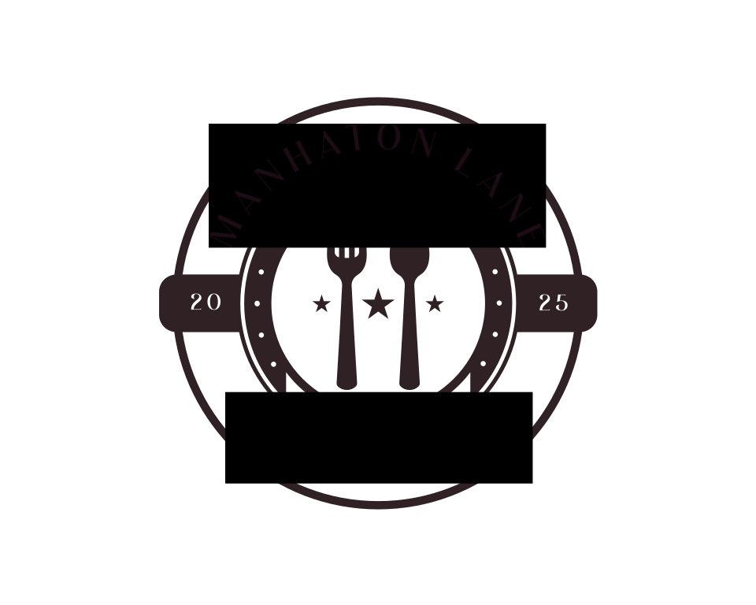

# Manhaton Lane Restaurant



A modern, responsive restaurant website for Manhaton Lane, Brisbane's premier destination for gourmet burgers and steaks. The website features a clean, intuitive design that showcases the restaurant's menu items and provides essential information to customers.

## 🌟 Features

- **Responsive Design**: Fully responsive layout that works seamlessly on desktop, tablet, and mobile devices
- **Dynamic Menu**: Interactive menu system with detailed item views
- **Modern UI**: Clean and professional interface with smooth animations and transitions
- **Accessibility**: WCAG compliant with full keyboard navigation and screen reader support
- **Performance**: Optimized images and assets for fast loading times

## 🛠️ Technologies Used

### Core
- [Next.js 14](https://nextjs.org/) - React framework for production
- [React](https://reactjs.org/) - JavaScript library for user interfaces
- [TypeScript](https://www.typescriptlang.org/) - Static typing for JavaScript

### Styling & UI
- [Tailwind CSS](https://tailwindcss.com/) - Utility-first CSS framework
- [shadcn/ui](https://ui.shadcn.com/) - Re-usable components built with Radix UI and Tailwind
- [Lucide Icons](https://lucide.dev/) - Beautiful open-source icons

### Fonts
- Quesha - For restaurant branding
- Baskervville - Primary text font

## 🚀 Getting Started

1. **Clone the repository**
   ```bash
   git clone https://github.com/yourusername/manhaton-lane.git
   cd manhaton-lane
   ```

2. **Install dependencies**
   ```bash
   npm install
   ```

3. **Run the development server**
   ```bash
   npm run dev
   ```

4. **Open your browser**
   Navigate to [http://localhost:3000](http://localhost:3000)

## 📦 Project Structure

```
manhaton-lane/
├── app/                  # Next.js app directory
│   ├── page.tsx         # Home page
│   ├── menu/            # Menu pages
│   └── about/           # About page
├── components/          # React components
├── public/              # Static assets
├── styles/             # Global styles
└── types/              # TypeScript types
```

## 🎨 Design Decisions

- **Color Scheme**: Clean, modern palette with emphasis on food photography
- **Typography**: Combination of decorative (Quesha) and readable (Baskervville) fonts
- **Layout**: Intuitive navigation with focus on menu items and key information
- **Mobile-First**: Designed with mobile users in mind, including touch-friendly navigation

## 🤝 Contributing

Contributions are welcome! Please feel free to submit a Pull Request.

## 📄 License

This project is licensed under the MIT License - see the [LICENSE](LICENSE) file for details.

## 👥 Authors

- Your Name - Initial work - [GitHub Profile](https://github.com/yourusername)

## 🙏 Acknowledgments

- Font providers
- Image assets
- Design inspiration
